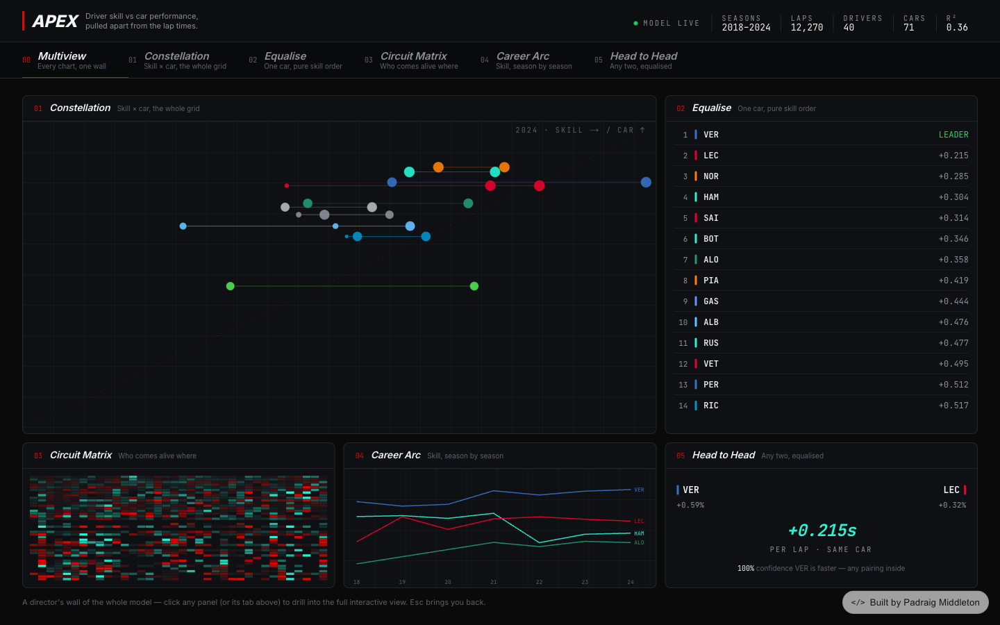
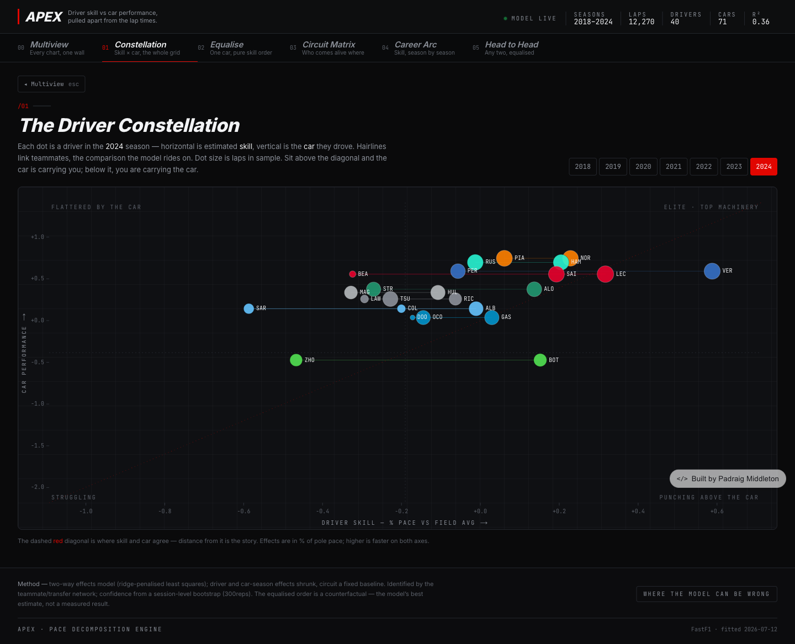
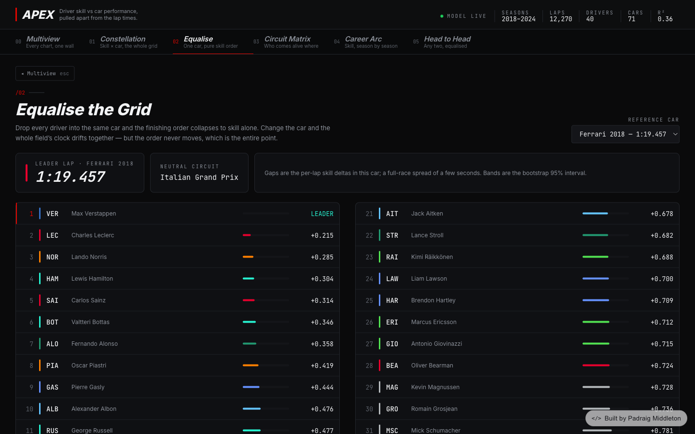
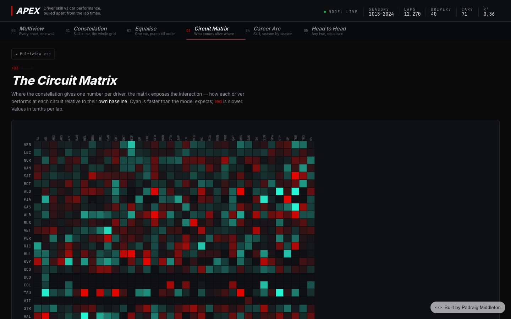
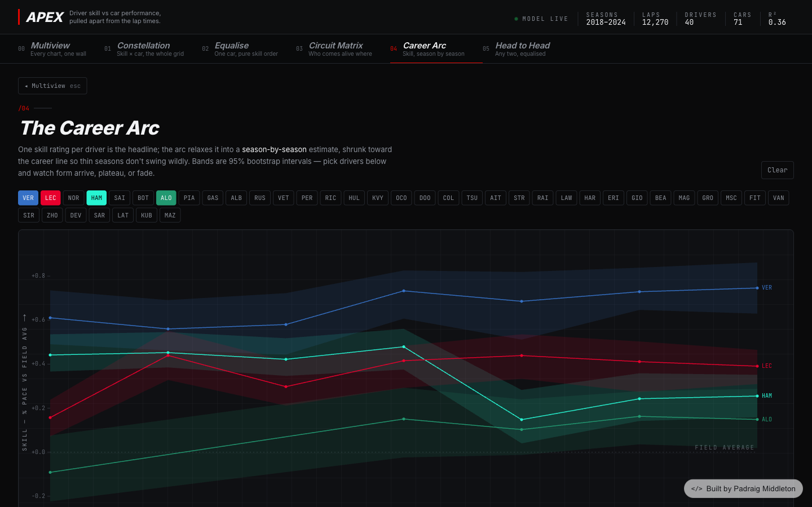
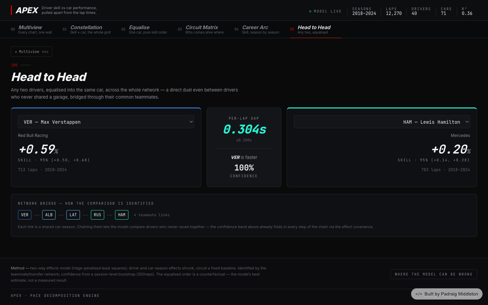

# APEX — F1 Driver Pace Analyser

Decomposing Formula 1 lap times into **driver skill** versus **car performance**.

**Live: [f1-pace-analyser.vercel.app](https://f1-pace-analyser.vercel.app/)**



I like Formula 1, and the argument that never dies is "great driver, or just a great car?"
The timing data to actually test that is public, so this project takes an honest crack at
it: seven seasons of qualifying laps, one statistical model, and a dashboard that lets you
put the whole grid in the same machinery and watch the real order fall out.

## The views

Everything lands on a multiview wall — every chart at once, click any panel to drill in.

### The Driver Constellation

Every driver plotted by estimated skill (→) against the car they drove (↑). Hairlines link
teammates — the comparisons the model is built on. Above the red diagonal, the car is
carrying you; below it, you're carrying the car.



### Equalise the Grid

The counterfactual: drop every driver into the same car and the finishing order collapses
to skill alone. Pick a different reference car and the whole field's clock shifts together —
the order never changes, which is the point.



### The Circuit Matrix

Driver × circuit residuals: who outruns their own baseline where. Cyan is faster than the
model expects, red slower — street-circuit specialists and Spa merchants show up as rows
with a pattern.



### Career Arc

One skill number per driver is the headline; the arc relaxes it season by season, with
95% confidence bands, so you can watch form arrive, plateau, or fade.



### Head to Head

Any two drivers, equalised — even ones who never shared a garage, bridged through the
teammate network, with a confidence figure that folds in every step of the chain.



## How the analysis works

1. **Ingest** — 12,270 qualifying laps, 2018–2024, from the official timing feed via
   [FastF1](https://github.com/theOehrly/Fast-F1), cached locally.
2. **Clean** — keep only genuine flying laps: timed, not in/out-laps, not deleted, fully
   green track.
3. **Normalise** — every lap becomes a % gap to its session best, so Monaco and Monza are
   comparable; the 107% rule trims the cool-down tail.
4. **Model** — each lap is `circuit + car-season + driver + noise`, fitted as
   ridge-penalised least squares. Driver and car effects are shrunk toward zero (a rookie
   with three laps is pulled to the field mean until the data earns a stronger claim);
   circuits are the fixed baseline.
5. **Identification** — driver and car are only separable because the grid is *connected*:
   teammates share a car, transfers carry their rating to a new one. Chain those links and
   the whole 2018–2024 grid becomes one network. (2021–2023 alone splinters into islands —
   you literally cannot rank Verstappen against Hamilton from it. That's why the window
   reaches back to 2018.)
6. **Uncertainty** — whole sessions are resampled and the model refitted 300 times; every
   number on the dashboard ships with its confidence interval.

The fit is written once to a single `apex.json` artifact that the dashboard reads
client-side — there is no backend. The full spec lives in
[`WHITEPAPER.md`](./WHITEPAPER.md), the artifact contract in
[`analysis/SCHEMA.md`](./analysis/SCHEMA.md), and a plain-English walkthrough of the code
in [`EXPLAIN.md`](./EXPLAIN.md) — including where the model can be wrong (in-season
upgrades, driver–car fit, wet laps — it's honest about all of it).

## Run it locally

```bash
# dashboard
cd frontend
npm install
npm run dev            # http://localhost:3000

# analysis (optional — regenerates apex.json)
python3 -m venv .venv && .venv/bin/pip install -r requirements.txt
.venv/bin/python analysis/build_artifact.py
.venv/bin/python analysis/verify_artifact.py
```

**Stack:** Python (pandas, NumPy, networkx, FastF1) for the pipeline · Next.js + D3 +
Tailwind for the dashboard.
